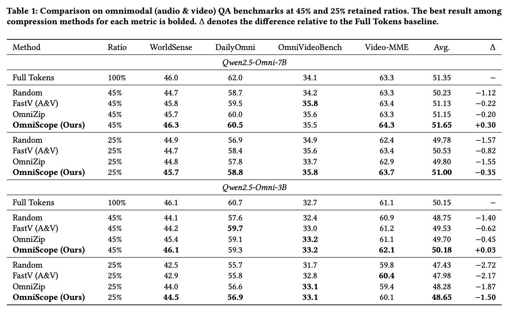

# OmniScope

[](https://arxiv.org/abs/2607.23193)
 [](https://video-rag.github.io/)
[](https://www.python.org/)
[](https://pytorch.org/)

**Modality-decoupled Token Compression for Efficient Omnimodal Video Understanding**

OmniScope is an efficient token compression framework designed for omnimodal video understanding. It decouples visual and audio tokens with modality-specific compression strategies, achieving significant computational savings while maintaining model performance.

---

## 📋 Table of Contents

- [Overview](#overview)
- [Installation](#installation)
- [Model Weights](#model-weights)
- [Usage](#usage)
- [Results](#results)
- [Project Structure](#project-structure)
- [Citation](#citation)
- [License](#license)
- [Acknowledgments](#acknowledgments)

---

## 🎯 Overview

OmniScope addresses the computational bottleneck of processing long video sequences in multimodal language models through modality-decoupled token compression.

### Key Features

- 🎬 **Video Understanding**: Optimized for long-form video comprehension tasks
- 🔊 **Audio-Visual Fusion**: Handles both visual frames and audio spectrograms
- ⚡ **Efficient Processing**: Significant token reduction with minimal accuracy trade-off
- 🔧 **Easy Integration**: Drop-in replacement for standard Qwen2.5-Omni inference

---

## 🛠️ Installation

### Prerequisites

- Python 3.10 or higher
- CUDA 12.4 compatible GPU (recommended)

### Setup

```bash
# 1. Create conda environment
conda create -n omniscope python=3.10 -y
conda activate omniscope

# 2. Install PyTorch with CUDA support
pip install --upgrade pip
pip install torch==2.6.0 torchvision==0.21.0 torchaudio==2.6.0 --index-url https://download.pytorch.org/whl/cu124

# 3. Install dependencies
pip install -r requirements.txt

# 4. Install Flash Attention (required for efficient attention computation)
pip install --no-build-isolation flash-attn==2.7.4.post1
```

---

## 📦 Model Weights

Download the following model weights before running inference:

| Model             | Link                                                                   | Description                      |
| ----------------- | ---------------------------------------------------------------------- | -------------------------------- |
| Qwen2.5-Omni-7B   | [HuggingFace](https://huggingface.co/Qwen/Qwen2.5-Omni-7B)              | Base multimodal language model   |
| CLIP ViT-L/14@336 | [HuggingFace](https://huggingface.co/openai/clip-vit-large-patch14-336) | Vision encoder for token scoring |

Update the paths in the evaluation scripts:

```python
QWEN_MODEL_PATH = "/path/to/Qwen2.5-Omni-7B"
CLIP_MODEL_NAME = "/path/to/clip-vit-large-patch14-336"
```

---

## 🚀 Usage

OmniScope can be evaluated on various video understanding benchmarks. Below is an example using the WorldSense dataset.

### Example: Evaluation on WorldSense

1. **Download the WorldSense dataset**:

   ```bash
   # Download videos from HuggingFace
   # Place them under data/worldsense_videos/
   ```

   Dataset: [WorldSense on HuggingFace](https://huggingface.co/datasets/honglyhly/WorldSense)
2. **Update data path** in `eval_worldSense.py`:

   ```python
   data_path = "/path/to/worldsense_videos"
   ```
3. **Run evaluation**:

   ```bash
   python eval_worldSense.py
   ```

Results will be saved to `results/worldSense/`.

> **Note**: To evaluate on other datasets, prepare your data in a similar JSON format (see `data/worldsense_format.json`) and adapt the evaluation script accordingly.

---

## 📊 Results



We evaluate OmniScope on four omnimodal audio-video understanding benchmarks under **45%** and **25%** token retention ratios.

**Key Findings:**

- **Nearly Lossless at 45% Retention**: OmniScope achieves the highest average accuracy among compression methods with nearly no accuracy loss compared to full tokens
- **Superior Performance at 25% Retention**: Under aggressive compression, OmniScope incurs the smallest accuracy drop:
  - On the 7B model: only **0.35-point** drop vs. OmniZip's **1.55-point** drop
- **Robust Cross-Modal Handling**: Independent modality-specific assessment avoids erroneously discarding critical information, especially at high compression ratios

For detailed experimental results across all benchmarks, please refer to our [paper](https://arxiv.org/abs/2607.23193).

---

## 📁 Project Structure

```
OmniScope/
├── eval_worldSense.py                      # WorldSense evaluation script
├── tools/
│   ├── __init__.py                         # Package initialization
│   ├── configuration_qwen2_5_omni.py       # Model configuration classes
│   ├── modeling_qwen2_5_omni.py            # Pruning-aware model implementation
│   ├── modular_qwen2_5_omni.py             # Modular model components
│   ├── processing_qwen2_5_omni.py          # Token allocation logic
│   └── qwenomni_prune_inference.py         # Core inference with ClipScorer & caching
├── data/
│   └── worldsense_format.json              # Evaluation data format
├── results/                                # Output directory
├── requirements.txt                        # Python dependencies
├── LICENSE                                 # Apache 2.0 License
└── README.md                               # This file
```

---

## 📖 Citation

If you find OmniScope useful in your research, please consider citing our paper:

```bibtex
@article{su2026omniscope,
  title={OmniScope: Modality-Decoupled Token Compression for Omnimodal Large Language Models},
  author={Su, Jinsen and Luo, Yongdong and Ma, Yuexiao and Hu, Yibo and Jin, Meiguang and Zheng, Xiawu},
  journal={arXiv preprint arXiv:2607.23193},
  year={2026}
}
```

---

## 📄 License

This project is licensed under the [Apache 2.0 License](LICENSE).

---

## 🙏 Acknowledgments

This work builds upon the following excellent open-source projects:

- [Qwen2.5-Omni](https://github.com/QwenLM/Qwen2.5-Omni) - Base multimodal model architecture
- [CLIP](https://github.com/openai/CLIP) - Vision encoder for cross-modal understanding

We thank the authors and contributors of these projects for making their work publicly available.

---

## 📮 Contact

For questions or feedback, please open an issue on this repository or contact consonnm@gmail.com.
